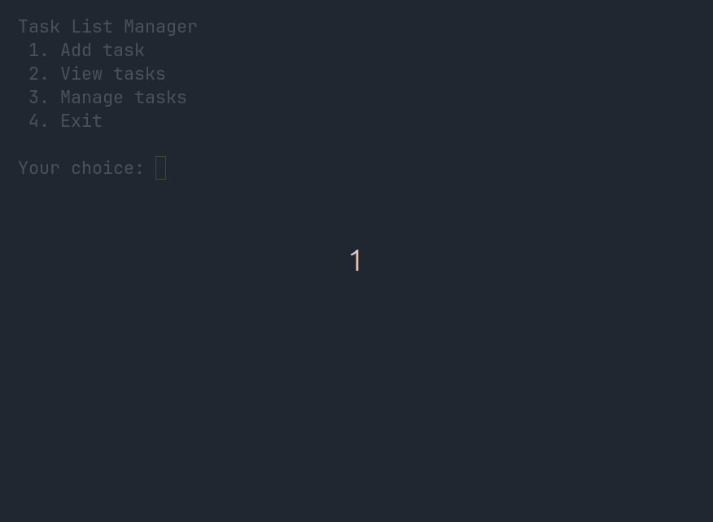

# Task List Manager
This is a simple CLI app made in Python to help users add, view and manage their tasks to boost productivity. Tasks can be added together with priority levels and organized into daily format or project list.


## Table of Contents
- [Features](#features)
- [Demo](#demo)
- [Getting Started](#getting-started)
- [Usage](#usage)
- [Project Structure](#project-structure)
- [Roadmap](#roadmap)
- [Tech Stack](#tech-stack)
- [Author](#author)
- [License](#license)


## Features
- Add tasks and view tasks
- Manage tasks (modify/delete/edit priority)
- Setting tasks with priorities
- Local storage of tasks


## Demo



## Getting Started
### Prerequisities
- Python 3.11 or higher
- Git 

### Installation
```
# Clone the repo
git clone https://github.com/self-reliantkid/task-list-manager

# Navigate to project folder
cd task-list-manager

# Run the app
# Windows
python main.py

# MacOS/Linux
python3 main.py
```


## Usage

| Option | Description |
|--------|-------------|
| 1. Add task | Create a new task with priority |
| 2. View task | Displays all added tasks with priority and completion status |
| 3. Manage tasks | Edit tasks, delete tasks and clear entire task list |
| 4. Exit | Quit the app |


## Project Structure
```
task-list-manager/
├── assets
│   └── demo.gif
├── main.py             # main app (menus)
├── storage.py          # storage system
├── task_system.py      # tasks logic
└── utils.py            # utility functions
```


## Roadmap
- Organize tasks in daily list format or sections
- Sorting of tasks based on preference
- Time frames attached to tasks


## Tech Stack
- **Language:** Python
- **Interface:** Command Line


## Author
- **Github:** [@self-reliantkid](https://www.github.com/self-reliantkid)
- **LinkedIn:** [Senanu Folikumah](https://www.linkedin.com/in/senanu-folikumah)


## License
This project is licensed under the [MIT License](LICENSE).